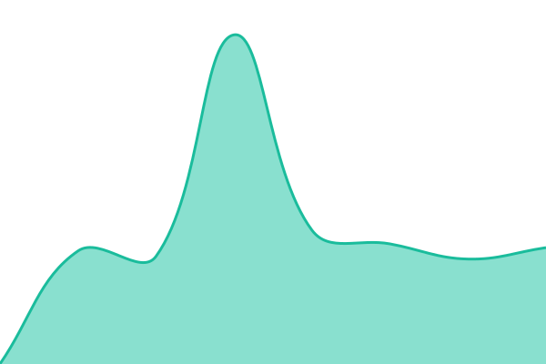

# [📈 Live Status](https://itbm-services.github.io/monitoring): <!--live status--> **🟧 Partial outage**

This repository contains the open-source uptime monitor and status page for [ITBM](https://itbm-services.github.io/monitoring), powered by [Upptime](https://github.com/upptime/upptime).

With [Upptime](https://upptime.js.org), you can get your own unlimited and free uptime monitor and status page, powered entirely by a GitHub repository. We use [Issues](https://github.com/itbm-services/monitoring/issues) as incident reports, [Actions](https://github.com/itbm-services/monitoring/actions) as uptime monitors, and [Pages](https://itbm-services.github.io/monitoring) for the status page.

<!--start: status pages-->
<!-- This summary is generated by Upptime (https://github.com/upptime/upptime) -->
<!-- Do not edit this manually, your changes will be overwritten -->
<!-- prettier-ignore -->
| URL | Status | History | Response Time | Uptime |
| --- | ------ | ------- | ------------- | ------ |
|  [CulturalGo Platform](https://culturalgo.com/plataform) | 🟩 Up | [cultural-go-platform.yml](https://github.com/itbm-services/monitoring/commits/HEAD/history/cultural-go-platform.yml) | 

 701ms
     
 | 

<a href="https://itbm-services.github.io/monitoring/history/cultural-go-platform">99.23%</a>
    

|  [Survey](https://newsurvey.culturalgo.com/) | 🟩 Up | [survey.yml](https://github.com/itbm-services/monitoring/commits/HEAD/history/survey.yml) | 

 184ms
     
 | 

<a href="https://itbm-services.github.io/monitoring/history/survey">99.80%</a>
    

|  [Culture Audit](https://culture04.culturalgo.com:8443/) | 🟩 Up | [culture-audit.yml](https://github.com/itbm-services/monitoring/commits/HEAD/history/culture-audit.yml) | 

 331ms
     
 | 

<a href="https://itbm-services.github.io/monitoring/history/culture-audit">99.85%</a>
    

|  [SuccesGo](https://success.culturalgo.com/) | 🟩 Up | [succes-go.yml](https://github.com/itbm-services/monitoring/commits/HEAD/history/succes-go.yml) | 

 2039ms
     
 | 

<a href="https://itbm-services.github.io/monitoring/history/succes-go">100.00%</a>
    

|  [Leadergo!](https://leadergo.org/) | 🟩 Up | [leadergo.yml](https://github.com/itbm-services/monitoring/commits/HEAD/history/leadergo.yml) | 

 1088ms
     
 | 

<a href="https://itbm-services.github.io/monitoring/history/leadergo">100.00%</a>
    

|  [CGO Express!](https://cgoxgptw.culturalgo.com/) | 🟥 Down | [cgo-express.yml](https://github.com/itbm-services/monitoring/commits/HEAD/history/cgo-express.yml) | 

 0ms
     
 | 

<a href="https://itbm-services.github.io/monitoring/history/cgo-express">0.00%</a>
    

<!--end: status pages-->

[**Visit our status website →**](https://itbm-services.github.io/monitoring)

## 📄 License

- Powered by: [Upptime](https://github.com/upptime/upptime)
- Code: [MIT](./LICENSE) © [ITBM](https://itbm-services.github.io/monitoring)
- Data in the `./history` directory: [Open Database License](https://opendatacommons.org/licenses/odbl/1-0/)
